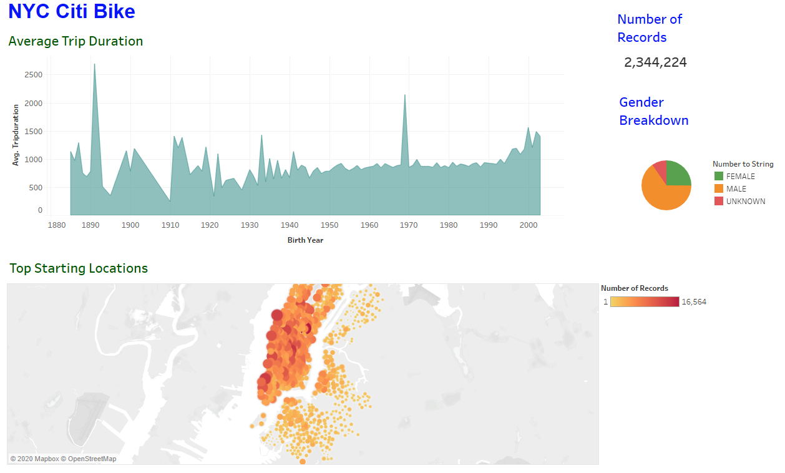

# NYC Citi Bike Data Analysis

## Project Overview
In this project, NYC Citi Bike data analysis was carried out for the month of August 2019 and created a Tableau story based on 
starting a bike sharing company in Des Moines.

## Tool
Tableau

## Tableau Workbook
bikesharing.twb

## Data Source
201908-citibike-tripdata.csv

## Summary 

- Manhattan is the most populated borough in New York City as per the maps referring to the top starting and ending locations.

- The number of records was 2,344,224.

- The Tableau Dashboards showing all the relevant details are:

## Dashboard-1:

## Dashboard-2:

- The bike sharing system analysis of New York City was done to find out how this system will work in Des Moines, Iowa.

- A Tableau story is created using all the relevant data and information of New York City and Des Moines to find out what, why and how a bike sharing program will perform in Des  Moines city.

- The link of the Tableau story to Tableau Public is: 

https://public.tableau.com/profile/archana.rohilla#!/vizhome/bikesharing_15873336607410/BikeSharingCompany-ABoom?publish=yes